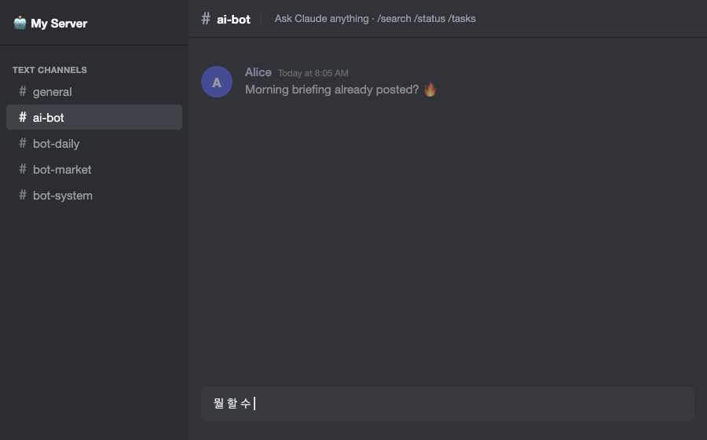

<p align="center">
  
  
  
  
  
  
</p>

<h1 align="center">Claude Discord Bridge</h1>

<p align="center">
  <strong>Your Claude Max subscription is idle 23 hours a day.<br>This turns it into a 24/7 Discord AI assistant — at $0 extra cost.</strong>
</p>

<p align="center">
  <a href="README.ko.md">한국어</a> · <a href="ROADMAP.md">Roadmap</a> · <a href="discord/SETUP.md">Setup Guide</a>
</p>

---

<p align="center">
  
  <br>
  <sub>Real-time streaming · tool-use indicators · session continuity across threads</sub>
</p>

> **No demo.gif yet?** Record one with [Kap](https://getkap.co) (macOS) or [Peek](https://github.com/phw/peek) (Linux):
> Show a Discord message → bot thinking reaction → streamed response → ✅ done + cost embed.

---

## TL;DR

| | |
|---|---|
| **What** | Self-hosted Discord bot backed by `claude -p` (Claude Code's headless CLI) |
| **Who** | Claude Max subscribers who want $0 extra AI costs |
| **How** | Spawns `claude -p` per message, streams output to Discord in real-time |
| **Why** | 24 scheduled cron tasks + reactive chat, in one bot, with 3+ hour sessions |

```
You type in Discord  →  claude -p answers  →  streamed reply in your thread
Cron fires at 08:05  →  claude -p writes standup  →  posted to #bot-daily
All while you sleep. No API bills. No context limits.
```

---

## The Numbers

<table>
<tr>
<td align="center" width="33%">

### $0 / month
*extra cost*

Claude Max subscription you already pay for. `claude -p` is included — no API keys, no metered billing.

</td>
<td align="center" width="33%">

### Up to 98% compression
*context reduction*

Nexus CIG intercepts every tool call output before it hits Claude's context window. In documented heavy-output cases (e.g. large JSON payloads), compression reaches 315 KB → 5.4 KB (98%). Typical savings vary by output type.

</td>
<td align="center" width="33%">

### 3+ hours
*session length*

Without compression, context fills in ~30 min on heavy-output tasks. With Nexus CIG active on tool-heavy workloads, multi-turn threads sustain for several hours before context pressure builds.

</td>
</tr>
</table>

---

## What It Does While You Sleep

Most bots are **reactive** — they wait for you to type. This one is **proactive**:

```
 YOU          BOT
 ────────────────────────────────────────────────────────────
 03:00  zzz   → Server maintenance scan        #bot-system
 08:05  zzz   → Morning standup briefing        #bot-daily
 09:00  ☕    ← You wake up to a full briefing already posted
 09:15        → Custom monitor (every 15 min)   #bot-market
 10:00        ↔ Real-time Discord chat (you type, it answers)
 12:00  🍜    → System health check             logs
 15:30        → Alert: threshold crossed        #bot-market + 📱
 18:00        ← You stop chatting
 20:00  zzz   → Daily summary                   #bot-daily
 00:30  zzz   → Log rotation + backup cleanup
 01:00  zzz   → RAG index rebuild (hourly, incremental)
 ────────────────────────────────────────────────────────────
              24 tasks. Zero manual intervention.
```

Every task has **exponential backoff retry** (3 attempts), **rate-limit awareness** (shared 5-hour sliding window), and **failure alerts** pushed to your phone via [ntfy](https://ntfy.sh).

---

## vs. the Alternatives

### Monthly Cost

| | **This bot** | **Clawdbot** (60K ⭐) | **Typical API bot** |
|---|---|---|---|
| AI cost | **$0 extra** | ~$36+/mo | $5 – $50+/mo |
| Requires | Claude Max subscription | Anthropic API key | API key + billing |
| Model quality | Opus / Sonnet (full) | Claude (via API) | Varies |

### Features

| | **This bot** | API-based bots | Clawdbot |
|---|---|---|---|
| Behavior model | **Proactive** (24 cron tasks) | Reactive only | Reactive only |
| Context management | **Nexus CIG** (98% compression) | None / basic | Basic |
| RAG / memory | LanceDB (vector + BM25 hybrid) | Rarely | Plugin-dependent |
| Self-healing | 3-layer watchdog | Manual restart | Varies |
| Session continuity | `--resume` multi-turn threads | Per-message | Varies |
| E2E test suite | **43/44** automated checks | Rare | Partial |
| Messenger support | Discord | Discord | 25+ platforms |

---

## Quick Start

### Prerequisites

- **Node.js ≥ 20** — `node -v`
- **Claude Code CLI** — `npm install -g @anthropic-ai/claude-code`
- **Claude Max subscription** — required for `claude -p` headless mode
- **Discord bot token** — [Discord Developer Portal](https://discord.com/developers/applications)
- **OpenAI API key** — for RAG embeddings (`text-embedding-3-small`, cheap)

### Option A: Docker

```bash
git clone https://github.com/Ramsbaby/claude-discord-bridge ~/claude-discord-bridge
cd ~/claude-discord-bridge
cp discord/.env.example discord/.env
# → edit discord/.env with your tokens
docker compose up -d
```

**Done.** Check logs with `docker compose logs -f`.

### Option B: Local (macOS / Linux)

```bash
# 1. Clone
git clone https://github.com/Ramsbaby/claude-discord-bridge ~/claude-discord-bridge
cd ~/claude-discord-bridge

# 2. Install
./install.sh --local

# 3. Configure
# edit discord/.env  (copy from discord/.env.example)
# edit discord/personas.json  (optional: per-channel system prompts)

# 4. Run
node discord/discord-bot.js
```

For persistent 24/7 operation on macOS, register as a LaunchAgent:

```bash
launchctl load ~/Library/LaunchAgents/ai.discord-bot.plist
```

See [discord/SETUP.md](discord/SETUP.md) for the full step-by-step setup.

---

## Configuration

### `discord/.env` (required)

```env
BOT_NAME=MyBot                       # Name shown in Discord messages
BOT_LOCALE=ko                        # Bot language: 'ko' (default) or 'en'
DISCORD_TOKEN=your_bot_token
GUILD_ID=your_server_id
CHANNEL_IDS=channel_id_1,channel_id_2
OWNER_NAME=YourName
OPENAI_API_KEY=your_key              # for RAG embeddings
NTFY_TOPIC=your_ntfy_topic          # optional: push notifications
```

### `discord/personas.json` (optional)

Per-channel personality. Each key is a Discord channel ID:

```json
{
  "123456789": "You are a senior developer. Be concise and technical.",
  "987654321": "You are a creative writing assistant with a witty tone."
}
```

### `config/tasks.json` (for cron automation)

```json
{
  "id": "morning-standup",
  "name": "Morning Standup",
  "schedule": "5 8 * * *",
  "prompt": "Summarize today's top priorities...",
  "output": ["discord"],
  "discordChannel": "bot-daily",
  "retry": { "max": 3, "backoff": "exponential" }
}
```

Copy from `config/tasks.json.example` to get started with 3 example tasks (morning-standup, daily-summary, system-health), then extend with your own.

---

## Architecture

```
Discord message
      │
      ▼
discord-bot.js ──► lib/handlers.js ──► lib/claude-runner.js
                         │                      │
                         │               spawnClaude()
                         │               claude -p --stream-json
                         │                      │
                  StreamingMessage        parseStreamEvents()
                  (live edits,                  │
                  2000-char chunks)      RAG context injection
                         │              (LanceDB hybrid search)
                         ▼
                  Discord thread reply
                         │
                         ▼
              saveConversationTurn()
                         │
                         ▼
              context/discord-history/YYYY-MM-DD.md
                         │
                         ▼
              Hourly RAG indexer (rag-index.mjs)
                         │
                         ▼
      ┌──────────────────────────────────────────┐
      │          Nexus CIG (MCP Server)          │
      │  Intercepts all tool output.             │
      │  315 KB raw → 5.4 KB compressed.         │
      │  Claude sees signals, not noise.         │
      └──────────────────────────────────────────┘
```

### Nexus CIG — Context Intelligence Gateway

Built as a local MCP server (`lib/mcp-nexus.mjs`). Sits between Claude and every system call, classifies output type, and compresses it before it enters the context window.

| Tool | What it does |
|------|-------------|
| `exec(cmd, max_lines)` | Run command, return compressed output |
| `scan(items[])` | Parallel multi-command, single response |
| `cache_exec(cmd, ttl)` | Cached execution (default 30s TTL) |
| `log_tail(name, lines)` | Named log access by shorthand |
| `health()` | Single-call system health summary |
| `file_peek(path, pattern)` | Pattern-aware partial file read |

JSON → key extraction · Logs → dedup + tail · Process tables → column filter

---

## Slash Commands

| Command | What it does |
|---------|-------------|
| `/search <query>` | Semantic search across RAG knowledge base |
| `/status` | System health + rate limit overview |
| `/tasks` | List configured cron tasks |
| `/run <task_id>` | Manually trigger a cron task |
| `/schedule <task_id> <delay>` | Schedule a task to run after a specified delay |
| `/threads` | List recent conversation threads |
| `/alert <message>` | Send alert → Discord + ntfy push |
| `/memory` | View current session memory |
| `/remember <text>` | Store a persistent memory entry |
| `/usage` | Token usage + rate limit stats |
| `/clear` | Clear session context |
| `/stop` | Cancel active `claude -p` subprocess |

---

## Self-Healing Infrastructure

Three independent layers. If any one fails, the others compensate:

```
Layer 1: launchd  (KeepAlive = true)
  └─ discord-bot.js auto-restarts on any exit

Layer 2: cron */5 min  →  bot-watchdog.sh
  ├─ Checks log freshness (15 min silence = unhealthy)
  ├─ Kills stale claude -p processes
  └─ Restarts bot if unresponsive

Layer 3: cron */3 min  →  launchd-guardian.sh
  ├─ Detects unloaded LaunchAgents
  └─ Re-registers them automatically
```

**Rate limiting:** shared `state/rate-tracker.json` — 900 requests per 5-hour window, split between bot and cron tasks.

---

## LanceDB Hybrid RAG

The bot remembers everything. Every conversation turn, cron result, and context file is indexed into a local LanceDB database:

- **Vector search** — OpenAI `text-embedding-3-small` (1536 dims)
- **Full-text search** — BM25 keyword matching
- **Reranking** — Reciprocal Rank Fusion (RRF) merges both signals

The RAG engine runs an incremental index hourly. When you ask a question, relevant context is injected into the `claude -p` prompt automatically — without consuming extra context window space.

---

## File Structure

```
~/claude-discord-bridge/
├── discord/
│   ├── discord-bot.js          # Discord client, slash commands
│   ├── locales/
│   │   ├── en.json             # English locale strings
│   │   └── ko.json             # Korean locale strings (default)
│   └── lib/
│       ├── i18n.js             # t() — locale loader (BOT_LOCALE)
│       ├── handlers.js         # handleMessage — core message logic
│       ├── claude-runner.js    # spawnClaude(), RAG injection, history
│       └── session.js          # SessionStore, RateTracker, Semaphore
├── bin/
│   ├── ask-claude.sh           # claude -p wrapper (RAG + token isolation)
│   ├── bot-cron.sh             # Cron task runner (semaphore, retry, routing)
│   └── rag-index.mjs           # Incremental RAG indexer
├── lib/
│   ├── rag-engine.mjs          # LanceDB hybrid search
│   └── mcp-nexus.mjs           # Nexus CIG MCP server
├── config/
│   ├── tasks.json.example      # 3 starter cron task definitions
│   └── monitoring.json.example # Webhook routing config
├── scripts/
│   ├── watchdog.sh             # Bot health monitor
│   ├── launchd-guardian.sh     # LaunchAgent auto-recovery
│   └── e2e-test.sh             # 43-item E2E test suite
├── context/                    # Per-task background knowledge files
├── results/                    # Cron task output history
└── state/                      # sessions.json, rate-tracker.json
```

---

## Platform Notes

| Feature | macOS (native) | Linux (Docker) |
|---------|---------------|----------------|
| Process supervision | `launchd` KeepAlive | Docker `restart: always` |
| Watchdog / Guardian | cron + bash | Same (runs in container) |
| Power management | `pmset` sleep disabled | N/A |
| Apple integrations | Notes, Reminders (optional) | Not available |

---

## Contributing

```bash
# 1. Fork + clone
git clone https://github.com/YOUR_USERNAME/claude-discord-bridge

# 2. Make changes

# 3. Run the test suite
bash scripts/e2e-test.sh
# → 43 passed, 0 failed

# 4. Submit a pull request
```

See [ROADMAP.md](ROADMAP.md) for planned features. Current completion: **82%**, target: **90%**.

---

## License

MIT — see [LICENSE](LICENSE)

---

<p align="center">
  <a href="README.ko.md">한국어 README →</a>
</p>
